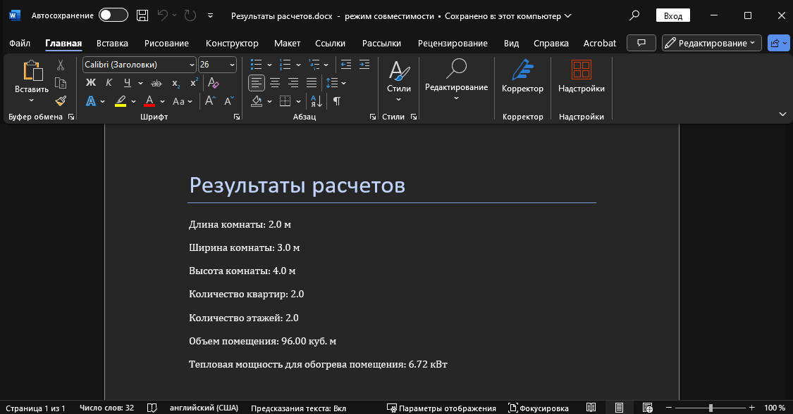

# lab12  

## Задание
      По своему варианту задания и GUI фреймворка создайте пакет, содержащий 3 модуля, и подключите его к основной программе. Основная программа должна предоставлять:

    графический пользовательский интерфейс с возможностями ввода требуемых параметров и отображения результатов расчёта,
    возможность сохранить результаты в отчёт формата .doc или .xls (например, пакеты python-docx и openpyxl).
## Проделанная работа
Опираясь на свой вариант (`2`), я использовал tkinter для создания программы. Она реализована с помощью трех пакетов (`docx_saver`,`calculations`, `gui`), запускаемых через `main.py`

## Скриншоты

## Список использованных источников

[лаба]([https://evil-teacher.on.fleek.co/prog_pm/lab1/](https://evil-teacher.on.fleek.co/prog_pm/term2/lab12/))

